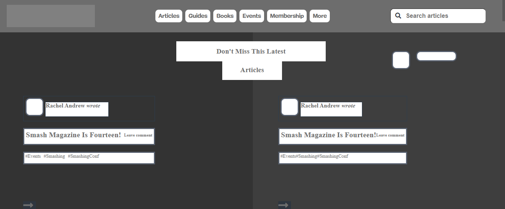

# Smashing-Magazine-ClonePage

> Building Smashing Magazine ClonePage Using HTML & CSS.




## Built With

- HTML and CSS

## Live Demo

[Live Demo Link](https://raw.githack.com/Takhmina175/SmashingMagazine-ClonePage/smashing-magazine/index.html)


## Getting Started

To get a local copy up and running follow these simple example steps.

### Prerequisites

> Browser
> Text editor of your choice.
> npm has to be installed in your system.
> install linters on your IDE.

### Setup

> `git clone git@github.com:Takhmina175/SmashingMagazine-ClonePage.git`

### Usage

> Open the index.html from your browser.

### Run tests

Run `npx html-validator-cli --quiet --file index.html` to run the validator over the `index.html` file.

The `--quiet` will only list `errors`. If you also want to see the warnings use the `--verbose` flag instead.
As an alternative, you can also install the `html5validator` using `pip`:

```
pip install --user html5validator
html5validator index.html
```


## Authors

👤 **Author1**

- GitHub: [@Takhmina175](https://github.com/Takhmina175)
- Twitter: [@Takhmina](https://twitter.com/Takhmin73630110)
- LinkedIn: [LinkedIn](https://www.linkedin.com/in/takhmina-makhkamova-7628136b/)

👤 **Author2**

- GitHub: [@okusarobert](https://github.com/okusarobert)
- Twitter: [@okusa_robert](https://twitter.com/okusa_robert)


## 🤝 Contributing

Contributions, issues and feature requests are welcome!

Feel free to check the [issues page](https://github.com/Takhmina175/SmashingMagazine-ClonePage/issues).

## Show your support

Give a ⭐️ if you like this project!

## 📝 License

This project is [MIT](lic.url) licensed.


